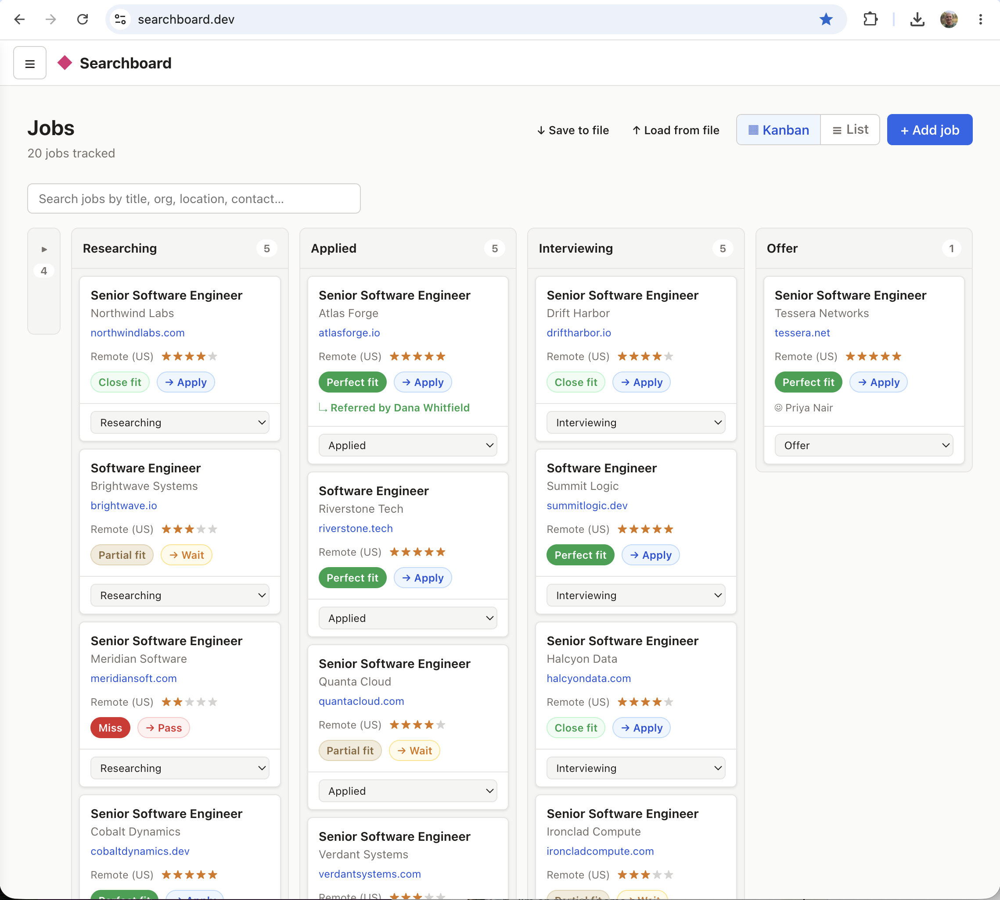

# Searchboard

A local-first dashboard for a deliberate, research-heavy job search. You track each **job** through its stages and score it against **your own explicit Fit Criteria**, so "should I pursue this?" is a written, repeatable judgment instead of a gut feel you re-derive every time.

**Live at [searchboard.dev](https://searchboard.dev).** See [`VISION.md`](./VISION.md) for the full product vision and scope.

## Demo



To see a populated board without setting anything up, load the bundled sample data. [`docs/sample-data.json`](docs/sample-data.json) is a self-contained export with 20 jobs across the pipeline (a variety of fit verdicts), their orgs and a few contacts, plus a filled-in Fit Criteria profile for a senior full-stack engineer. Run the app, then on the Jobs page or in **Settings** click **↑ Load from file** and pick it. Loading *merges* (newer records win, nothing is erased), so use it on a fresh board, or **↓ Save to file** first if you want to keep your own data.

## Privacy by architecture, not policy

Your job search is sensitive: who you're talking to, what you'd accept, why you passed on a role. Searchboard is built so that information **physically cannot leak from a server, because it never reaches one.** This isn't a promise in a policy page you have to trust; it's a property of how the app is built:

- **No login, no accounts, no sign-up.** There's nothing to register, and no identity tied to your data.
- **No database, no server-side storage of your data, ever.** Every job, org, contact, note, and your Fit Criteria lives in your browser's `localStorage` and in a JSON file *you* own. Export it, back it up, move it between browsers, read it in a text editor; it's yours, in a format you control.
- **The AI endpoints are stateless proxies.** When you score a job or seed criteria from a résumé, the serverless function sees only the text you pasted, just long enough to do that one task, then forgets it. Nothing about you is stored or logged server-side; the function exists solely to keep the shared Anthropic key off the client.
- **The only way data leaves your machine is when you trigger it:** exporting your JSON. There's no background sync, no telemetry on your tracking data, nothing phoning home.

There's no account to breach, no database to exfiltrate, and no "we promise not to look." The server has nowhere to put your tracking data, so it doesn't. See [`VISION.md`](./VISION.md) for the full principle.

## Status

Built and deployed. The core is in daily use: the Jobs board (kanban + list, with keyword search), the Fit Criteria editor, on-demand fit scoring with a calibration loop, résumé-seeded criteria, Orgs, Contacts, and JSON export/import. A Vitest suite runs in CI on every push and pull request. Analysis and Action Items exist in the data model and code but aren't currently surfaced in the nav (Action Items is planned to return; see VISION).

## What it does

- **Jobs**: the full-screen home. Track roles by stage in a kanban or list view; moving one into *Applied* stamps the applied date automatically. A keyword search above the board filters live in both views (every term must match the job's title, org, location, stage, comp, notes, or contacts). Moving a job to *Closed* prompts for a required reason plus optional notes, which then surface as a tooltip on the card and are included in search.
- **Fit Criteria**: a living profile of what you want next. **Hard filters** (comp floor, remote, excluded domains, IC-coding balance) are checked instantly in your browser, and **soft preferences** are what the AI weighs. Can be seeded from your résumé.
- **Fit scoring**: score any job on demand against your criteria. Returns a two-axis verdict: *fit* (perfect / close / partial / miss) and recommended *action* (apply / wait / pass), with short per-dimension reasoning. Fit is *derived* from a per-dimension rubric (role, domain, comp, and stack each rated match / partial / gap), so *perfect* only lands when every dimension matches and comp is stated above your floor. Scoring is deterministic (temperature 0): the same JD plus criteria yields the same verdict. Hard-filter trips are decided in-browser with no AI call.
- **Calibration loop**: rate any verdict ("was this right?") and your correction is stored and fed back as a few-shot anchor, so future scores match your bar. Correcting a verdict also overrides this job's score immediately, with a persistent "you set this" indicator; examples are managed from the Criteria page (kept to the most recent few).
- **Orgs & Contacts**: the companies you're evaluating and the people you're building relationships with, linked back to jobs. Reached from the hamburger menu.
- **Paste-to-populate**: paste a job description (or a Greenhouse/Lever posting URL) and have the fields filled in.

## Architecture at a glance

- **Frontend**: Vite + React (React Router), deployed as a static site on Vercel.
- **Backend**: a small set of Vercel serverless functions that hold the Anthropic API key server-side and each proxy one narrowly-scoped task:
  - `api/parse.js`: extract structured fields from a pasted JD (or resolve a Greenhouse/Lever URL via the allowlisted resolver in `api/_ats.js`; the server never fetches arbitrary user URLs).
  - `api/score-fit.js`: personalized fit scoring from your criteria + a JD.
  - `api/parse-resume.js`: turn a pasted résumé into seed values for your Fit Criteria.
  - Shared helpers: `api/_ratelimit.js` (best-effort per-IP cap), `api/_ats.js`, and `api/_usage.js` (logs per-call token usage and returns a compact `_usage` to the client).
- **Rate limiting**: a daily cap per browser for each task (`parse` 50, `score` 25, `resume` 50; see `DAILY_LIMITS` in `src/lib/store.js`), backed by the server-side per-IP limiter.
- **Storage**: no database, no accounts. All tracking data lives in the browser's localStorage and in the JSON file you export/import. The AI endpoints only ever see pasted text (JD or résumé) transiently; never stored, never logged.
- **Token usage panel**: a per-browser tally of tokens sent through the shared key (cumulative input/output per task, with a rough cost estimate). It's a personal diagnostic, hidden by default: append `?showusage` to the Settings URL (`/settings?showusage`) to reveal it. The Anthropic Console remains authoritative for real spend.

## Local development

```bash
npm install
cp .env.example .env.local   # then fill in ANTHROPIC_API_KEY (unquoted)
npx vercel dev                # runs the Vite frontend and /api functions together
```

Plain `npm run dev` (Vite only) runs the UI, but the AI calls will fail, so use `vercel dev` for the full stack locally.

Run the tests with `npm test` (Vitest, single run) or `npm run test:watch`. The same suite plus a production build runs in CI (`.github/workflows/ci.yml`) on every push to `main` and every pull request.

Two gotchas worth knowing:
- If the project is linked to Vercel (`vercel link`), `vercel dev` pulls function env from the cloud **Development** environment and ignores `.env.local`, so set `ANTHROPIC_API_KEY` there.
- Store the key **unquoted**; a quoted value is passed literally and yields a 401.

## Deployment

Connected to Vercel. Push to `main` to deploy. Set `ANTHROPIC_API_KEY` in the Vercel project's Environment Variables (never commit it).

## Links

- Live site: https://searchboard.dev
- Repo: https://github.com/bobbrose/searchboard

## License

MIT. See [LICENSE](LICENSE). Copyright (c) 2026 Bob Rose (https://bobbrose.com).
